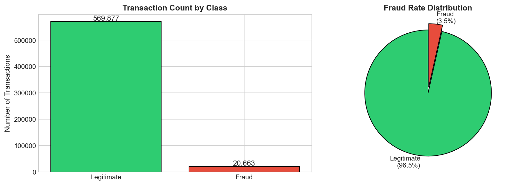
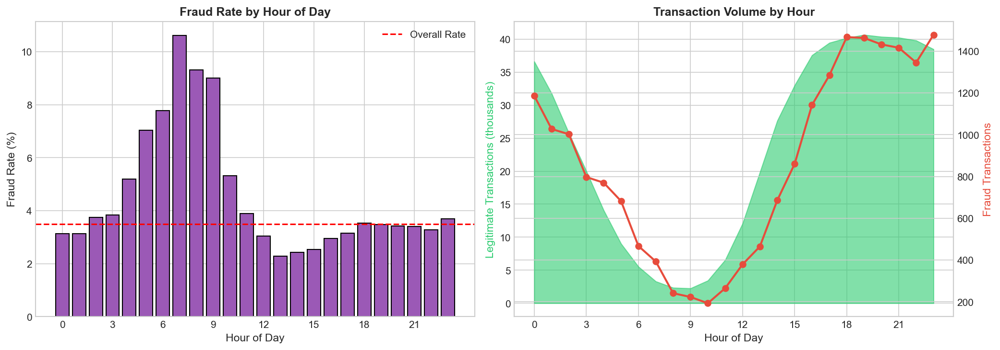

# Fraud Detection MLOps Pipeline

End-to-end ML pipeline for credit card fraud detection using the IEEE-CIS dataset. XGBoost model achieving **94.3% AUC**, served via FastAPI, tracked with MLflow, monitored with Evidently, deployed on GCP Cloud Run.

**Live API**: https://fraud-detection-api-1040464397198.us-central1.run.app

## Pipeline Architecture

```
┌─────────────┐    ┌──────────────────┐    ┌─────────────────┐
│  Raw Data   │───▶│  Preprocessing   │───▶│    Training     │
│  (CSV)      │    │  (fit on train)  │    │  (XGBoost)      │
└─────────────┘    └──────────────────┘    └─────────────────┘
                          │                        │
                          ▼                        ▼
                  ┌──────────────────┐    ┌─────────────────┐
                  │    Artifacts     │    │     Model       │
                  │ (encoders,       │    │   (joblib)      │
                  │  medians, etc)   │    └─────────────────┘
                  └──────────────────┘             │
                          │                        │
                          ▼                        ▼
┌─────────────┐    ┌──────────────────┐    ┌─────────────────┐
│  API Input  │───▶│  Preprocessing   │───▶│   Inference     │───▶ Prediction
│  (JSON)     │    │  (transform)     │    │                 │
└─────────────┘    └──────────────────┘    └─────────────────┘
                                                   │
                                                   ▼
                                          ┌─────────────────┐
                                          │ Drift Monitor   │
                                          │ (Evidently)     │
                                          └─────────────────┘
```

Training and inference use the **same preprocessing artifacts**, avoiding train/serve skew.

## Key Findings (EDA)

See [`notebooks/01_eda_fraud_detection.ipynb`](notebooks/01_eda_fraud_detection.ipynb) for full analysis.

| Metric | Value |
|--------|-------|
| Total transactions | 590,540 |
| Fraud rate | 3.5% |
| Class imbalance | 27:1 |

**Key insights:**
- **Transaction amount**: Higher amounts ($500-$5K+) have elevated fraud rates (5-6% vs 3.5% overall)
- **Temporal patterns**: Peak fraud at 7 AM (~10.5% fraud rate)
- **Email domains**: Strong fraud signal - some domains have 2-3x higher fraud rates
- **Missing data**: 414 features have missing values (handled via median imputation)




## Model Performance

| Metric | Value |
|--------|-------|
| AUC-ROC | 0.943 |
| Average Precision | 0.665 |
| F1 Score | 0.460 |
| Precision | 0.325 |
| Recall | 0.789 |

## Quick Start

### Local Setup

```bash
python -m venv venv
source venv/bin/activate  # venv\Scripts\activate on Windows
make install
```

Download the [IEEE-CIS Fraud Detection](https://www.kaggle.com/c/ieee-fraud-detection/data) dataset and place `train_transaction.csv` and `train_identity.csv` in `data/raw/`.

```bash
make train          # process data + train model (logs to MLflow)
make serve          # start API locally at http://localhost:8000
make docker-up      # run API + MLflow UI with docker compose
make test           # run tests
```

### Try the Live API

```bash
# Health check
curl https://fraud-detection-api-1040464397198.us-central1.run.app/health

# Get model info
curl https://fraud-detection-api-1040464397198.us-central1.run.app/model-info

# Make a prediction
curl -X POST https://fraud-detection-api-1040464397198.us-central1.run.app/predict \
  -H "Content-Type: application/json" \
  -d '{
    "TransactionAmt": 500.0,
    "ProductCD": "W",
    "card4": "visa",
    "P_emaildomain": "gmail.com"
  }'
```

Response:
```json
{"fraud_probability": 0.526, "is_fraud": true, "confidence": 0.526}
```

## API Endpoints

| Endpoint | Method | Description |
|----------|--------|-------------|
| `/health` | GET | Health check, model load status |
| `/model-info` | GET | Model type, features, metrics |
| `/predict` | POST | Fraud prediction |
| `/docs` | GET | Interactive API documentation |

## Tech Stack

| Component | Technology |
|-----------|------------|
| Model | XGBoost |
| API | FastAPI + Uvicorn |
| Experiment Tracking | MLflow |
| Monitoring | Evidently |
| CI/CD | GitHub Actions |
| Containerization | Docker |
| Cloud Deployment | GCP Cloud Run |

## Project Structure

```
├── src/
│   ├── config.py            # paths, hyperparams, feature lists
│   ├── preprocessing.py     # feature engineering (shared train/inference)
│   ├── data_processing.py   # data loading, train/test split
│   ├── train.py             # training with MLflow logging
│   ├── predict.py           # inference service
│   ├── monitor.py           # drift detection with Evidently
│   └── api.py               # FastAPI endpoints
├── notebooks/
│   └── 01_eda_fraud_detection.ipynb  # exploratory data analysis
├── models/                  # saved model + preprocessing artifacts
├── tests/                   # pytest tests
├── Dockerfile
├── docker-compose.yml
└── .github/workflows/ci.yml # CI/CD pipeline
```

## Data & Methodology

- **No data leakage**: Train/test split happens *before* fitting encoders and computing statistics
- **Stratified split**: 80/20 split preserving fraud rate (~3.5%) in both sets
- **Preprocessing artifacts**: Encoders, medians, and count mappings saved for consistent inference
- **Unseen categories**: New categorical values mapped to "unknown" (included in training vocabulary)
- **Class imbalance**: Handled via `scale_pos_weight=20` in XGBoost

## CI/CD

On push to `main`: lint (ruff) → test (pytest) → docker build + verify.

## GCP Cloud Run Deployment

The API is deployed at: https://fraud-detection-api-1040464397198.us-central1.run.app

To deploy your own:

```bash
# Set project
gcloud config set project YOUR_PROJECT_ID

# Enable APIs
gcloud services enable run.googleapis.com artifactregistry.googleapis.com cloudbuild.googleapis.com

# Build and push
gcloud builds submit --tag gcr.io/YOUR_PROJECT_ID/fraud-detection-api

# Deploy
gcloud run deploy fraud-detection-api \
  --image gcr.io/YOUR_PROJECT_ID/fraud-detection-api \
  --platform managed \
  --region us-central1 \
  --port 8000 \
  --memory 1Gi \
  --allow-unauthenticated
```

Cloud Run scales to zero when not in use, making it cost-effective for portfolio projects.
